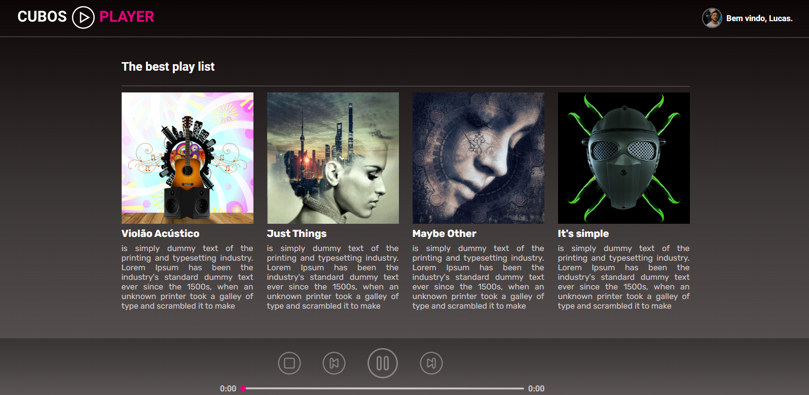

<h1 style="font-family: sans-serif;">Projeto Music Player</h1>

<h2 style="font-family: sans-serif;">Sobre o projeto:</h2>

    O objetivo desse projeto foi desenvolver uma aplicação web utilizando o React e suas funcionalidades. Com essa magnífica biblioteca para web e interfaces de usuário nativas foi possível criar essa aplicação que se trata de um mini **Player de Música**. Para produzir o layout foi utilizado o arquivo figma disponibilizado pela {c:#E5007B}Cubos Academy{/c} na aula de desafios React, onde pude aprimorar e por em prática meus conhecimentos.

<h2 style="font-family: sans-serif;">Sobre o Player de Música:</h2>

    Trata-se de um tocador de música com algumas músicas e controles básicos de play, pause, next, previous e stop. A aplicação pode ser testada clicando nesse link: <a href="http://music-player-olivr.netlify.app">music-player-olivr.netlify.app</a>

<h2 style="font-family: sans-serif;">Layout:</h2>

<h2 style="font-family: sans-serif;">Como utilizar os códigos desse repositório:</h2>

    Caso queira utilizar o código presente nesse repositório basta cloná-lo para sua máquina e utilizar o comando npm install no terminal do seu Editor de código para instalar node_modules e suas dependências. Após isso você poderá rodar a aplicação utilizando o comando npm run dev.

<h2 style="font-family: sans-serif;">Tecnologias utilizadas</h2>

<ul>
    <li>React</li>
    <li>HTML(JSX)</li>
    <li>CSS</li>
    <li>JavaScript</li>
</ul>

<h2 style="font-family: sans-serif;">Autor do código</h2>

Lucas Oliveira

<h2 style="font-family: sans-serif;">Links</h2>

<a href="http://www.linkedin.com/in/lucas-de-oliveira-5b8a5532" target="_blank">LinkedIn</a>
 
<a href="http://music-player-olivr.netlify.app">Music Player</a>
 